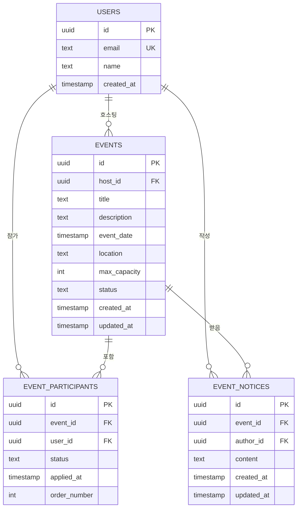

# P1-1.4 데이터 모델 설계

## 개요

이벤트 관리 앱의 핵심 데이터 모델을 정의합니다. Supabase PostgreSQL 데이터베이스에서 구현될 테이블 스키마, 관계, 그리고 Row-Level Security (RLS) 정책을 설계합니다.

## ERD (Entity Relationship Diagram)

### Mermaid 다이어그램



## 테이블 스키마 상세

### 1. USERS (auth.users)

Supabase 내장 인증 테이블 (자동 관리)

```sql
CREATE TABLE auth.users (
  id UUID PRIMARY KEY DEFAULT gen_random_uuid(),
  email TEXT NOT NULL UNIQUE,
  encrypted_password TEXT,
  raw_user_meta_data JSONB,
  created_at TIMESTAMP WITH TIME ZONE DEFAULT NOW(),
  updated_at TIMESTAMP WITH TIME ZONE DEFAULT NOW()
)
```

**주요 필드:**
- `id` — 사용자 UUID (PK)
- `email` — 이메일 (고유)
- `created_at` — 계정 생성 시간

### 2. EVENTS (public.events)

이벤트 정보 테이블

```sql
CREATE TABLE public.events (
  id UUID PRIMARY KEY DEFAULT gen_random_uuid(),
  host_id UUID NOT NULL REFERENCES auth.users(id),
  title TEXT NOT NULL,
  description TEXT,
  event_date TIMESTAMP WITH TIME ZONE NOT NULL,
  location TEXT NOT NULL,
  max_capacity INTEGER NOT NULL CHECK (max_capacity > 0),
  status TEXT NOT NULL DEFAULT 'active' CHECK (status IN ('active', 'cancelled', 'completed')),
  created_at TIMESTAMP WITH TIME ZONE DEFAULT NOW(),
  updated_at TIMESTAMP WITH TIME ZONE DEFAULT NOW()
)
```

**주요 필드:**
- `id` — 이벤트 UUID (PK)
- `host_id` — 주최자 UUID (FK → auth.users.id)
- `title` — 이벤트 제목
- `description` — 이벤트 설명 (선택)
- `event_date` — 이벤트 개최 일시 (ISO 8601)
- `location` — 개최 장소
- `max_capacity` — 최대 참가자 수
- `status` — 상태 (active, cancelled, completed)
- `created_at` — 생성 시간
- `updated_at` — 마지막 수정 시간

**인덱스:**
```sql
CREATE INDEX idx_events_host_id ON public.events(host_id);
CREATE INDEX idx_events_status ON public.events(status);
CREATE INDEX idx_events_event_date ON public.events(event_date);
```

### 3. EVENT_PARTICIPANTS (public.event_participants)

이벤트 참가자 정보 테이블

```sql
CREATE TABLE public.event_participants (
  id UUID PRIMARY KEY DEFAULT gen_random_uuid(),
  event_id UUID NOT NULL REFERENCES public.events(id) ON DELETE CASCADE,
  user_id UUID NOT NULL REFERENCES auth.users(id),
  status TEXT NOT NULL DEFAULT 'confirmed' CHECK (status IN ('confirmed', 'waitlist', 'cancelled')),
  applied_at TIMESTAMP WITH TIME ZONE DEFAULT NOW(),
  order_number INTEGER NOT NULL,
  UNIQUE(event_id, user_id)
)
```

**주요 필드:**
- `id` — 참가 기록 UUID (PK)
- `event_id` — 이벤트 UUID (FK → events.id, CASCADE DELETE)
- `user_id` — 참가자 UUID (FK → auth.users.id)
- `status` — 참가 상태 (confirmed, waitlist, cancelled)
- `applied_at` — 신청 시간
- `order_number` — 신청 순서 (confirmed 순서 관리)
- **UNIQUE(event_id, user_id)** — 중복 참가 방지

**인덱스:**
```sql
CREATE INDEX idx_event_participants_event_id ON public.event_participants(event_id);
CREATE INDEX idx_event_participants_user_id ON public.event_participants(user_id);
CREATE INDEX idx_event_participants_status ON public.event_participants(status);
```

### 4. EVENT_NOTICES (public.event_notices)

이벤트 공지사항 테이블

```sql
CREATE TABLE public.event_notices (
  id UUID PRIMARY KEY DEFAULT gen_random_uuid(),
  event_id UUID NOT NULL REFERENCES public.events(id) ON DELETE CASCADE,
  author_id UUID NOT NULL REFERENCES auth.users(id),
  content TEXT NOT NULL,
  created_at TIMESTAMP WITH TIME ZONE DEFAULT NOW(),
  updated_at TIMESTAMP WITH TIME ZONE DEFAULT NOW()
)
```

**주요 필드:**
- `id` — 공지사항 UUID (PK)
- `event_id` — 이벤트 UUID (FK → events.id, CASCADE DELETE)
- `author_id` — 작성자 UUID (FK → auth.users.id)
- `content` — 공지사항 내용
- `created_at` — 생성 시간
- `updated_at` — 수정 시간

**인덱스:**
```sql
CREATE INDEX idx_event_notices_event_id ON public.event_notices(event_id);
CREATE INDEX idx_event_notices_author_id ON public.event_notices(author_id);
CREATE INDEX idx_event_notices_created_at ON public.event_notices(created_at);
```

## Row-Level Security (RLS) 정책

### 1. EVENTS 테이블 RLS

**정책 1: 모든 사용자가 이벤트 조회 가능 (SELECT)**

```sql
CREATE POLICY "enable_select_for_all" ON public.events
  FOR SELECT
  USING (true)
```

**정책 2: 인증 사용자만 이벤트 생성 (INSERT)**

```sql
CREATE POLICY "enable_insert_for_authenticated_users" ON public.events
  FOR INSERT
  WITH CHECK (auth.uid() = host_id)
```

**정책 3: 주최자만 수정 (UPDATE)**

```sql
CREATE POLICY "enable_update_for_host" ON public.events
  FOR UPDATE
  USING (auth.uid() = host_id)
  WITH CHECK (auth.uid() = host_id)
```

**정책 4: 주최자만 삭제 (DELETE)**

```sql
CREATE POLICY "enable_delete_for_host" ON public.events
  FOR DELETE
  USING (auth.uid() = host_id)
```

### 2. EVENT_PARTICIPANTS 테이블 RLS

**정책 1: 본인 또는 이벤트 주최자만 조회 (SELECT)**

```sql
CREATE POLICY "enable_select_for_own_or_host" ON public.event_participants
  FOR SELECT
  USING (
    auth.uid() = user_id
    OR
    auth.uid() IN (
      SELECT host_id FROM public.events
      WHERE id = event_id
    )
  )
```

**정책 2: 인증 사용자만 신청 (INSERT)**

```sql
CREATE POLICY "enable_insert_for_authenticated_users" ON public.event_participants
  FOR INSERT
  WITH CHECK (auth.uid() = user_id)
```

**정책 3: 본인 또는 주최자만 수정 (UPDATE)**

```sql
CREATE POLICY "enable_update_for_own_or_host" ON public.event_participants
  FOR UPDATE
  USING (
    auth.uid() = user_id
    OR
    auth.uid() IN (
      SELECT host_id FROM public.events
      WHERE id = event_id
    )
  )
  WITH CHECK (
    auth.uid() = user_id
    OR
    auth.uid() IN (
      SELECT host_id FROM public.events
      WHERE id = event_id
    )
  )
```

**정책 4: 본인만 취소 (DELETE)**

```sql
CREATE POLICY "enable_delete_for_own" ON public.event_participants
  FOR DELETE
  USING (auth.uid() = user_id)
```

### 3. EVENT_NOTICES 테이블 RLS

**정책 1: 해당 이벤트의 confirmed 참가자 또는 주최자만 조회 (SELECT)**

```sql
CREATE POLICY "enable_select_for_confirmed_or_host" ON public.event_notices
  FOR SELECT
  USING (
    auth.uid() IN (
      SELECT host_id FROM public.events
      WHERE id = event_id
    )
    OR
    auth.uid() IN (
      SELECT user_id FROM public.event_participants
      WHERE event_id = event_notices.event_id
      AND status = 'confirmed'
    )
  )
```

**정책 2: 이벤트 주최자만 생성 (INSERT)**

```sql
CREATE POLICY "enable_insert_for_host" ON public.event_notices
  FOR INSERT
  WITH CHECK (
    auth.uid() IN (
      SELECT host_id FROM public.events
      WHERE id = event_id
    )
  )
```

**정책 3: 이벤트 주최자만 수정 (UPDATE)**

```sql
CREATE POLICY "enable_update_for_host" ON public.event_notices
  FOR UPDATE
  USING (
    auth.uid() IN (
      SELECT host_id FROM public.events
      WHERE id = event_id
    )
  )
  WITH CHECK (
    auth.uid() IN (
      SELECT host_id FROM public.events
      WHERE id = event_id
    )
  )
```

**정책 4: 이벤트 주최자만 삭제 (DELETE)**

```sql
CREATE POLICY "enable_delete_for_host" ON public.event_notices
  FOR DELETE
  USING (
    auth.uid() IN (
      SELECT host_id FROM public.events
      WHERE id = event_id
    )
  )
```

## RLS 활성화

```sql
-- 각 테이블에 대해 실행
ALTER TABLE public.events ENABLE ROW LEVEL SECURITY;
ALTER TABLE public.event_participants ENABLE ROW LEVEL SECURITY;
ALTER TABLE public.event_notices ENABLE ROW LEVEL SECURITY;
```

## 데이터 모델 특징

1. **계층적 구조** — events → event_participants, event_notices로 확장
2. **CASCADE 삭제** — 이벤트 삭제 시 참가자 기록 및 공지사항 자동 삭제
3. **중복 방지** — event_participants의 UNIQUE 제약으로 중복 참가 방지
4. **순서 관리** — order_number로 신청 순서 추적 (대기열 관리)
5. **감시 필드** — created_at, updated_at로 시간 추적
6. **세분화된 RLS** — 공개/인증/주최자/참가자별 접근 제어

## Phase 2 후속 작업

- 마이그레이션 파일 작성 (Supabase CLI)
- TypeScript 타입 자동 생성 (`supabase gen types typescript`)
- Server Actions에서 타입 매핑 구현
- Realtime 구독 설정 (참가자 변경 사항 실시간 반영)
